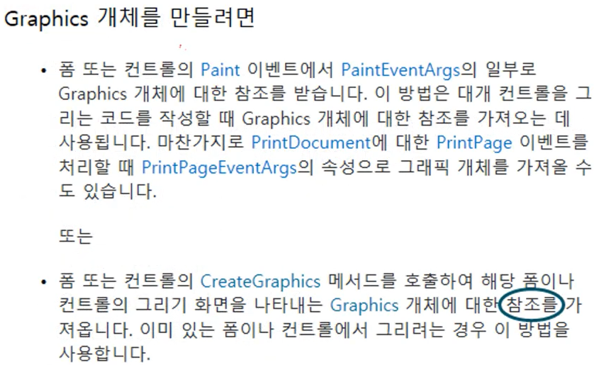

- Book Mark
    
    > [!info] c# 언어 18강. GDI+ (2/2) - Color, Pen, Brush  
    > 반갑습니다.  
    > [https://www.youtube.com/watch?v=-38pj-PoN0E&list=PLOKPEzlY4JKQNiHEQ4SDBxAFo9RDod8Tm&index=37](https://www.youtube.com/watch?v=-38pj-PoN0E&list=PLOKPEzlY4JKQNiHEQ4SDBxAFo9RDod8Tm&index=37)  
    

- GDI & GDI+
    - GDI (Graphics Device Interface) ⇒ OS의 영역
    - GDI+ ⇒ .NET은 Graphics가 담당
- Graphics 사용 방법
    - Paint Event
    - CreateGraphics Object
        - Paint Event가 존재 하지 않을 경우 사용한다.



- CreateGraphics Object
    
    - Description
        - Namespace ⇒ System.Windows.Forms
        - 사용 후 ⇒ Graphics.Dispose() 호출
    
    ```C#
    static public Graphics CreateGraphics()
    ```