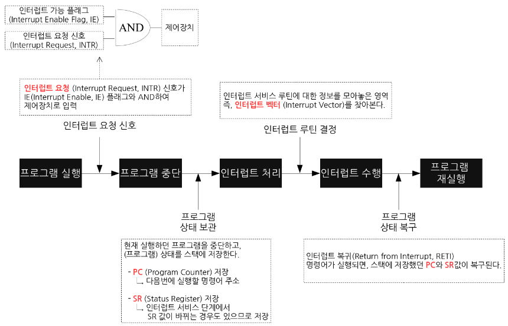

- Index
    
    01. Interrupt
    
    01) Interrupt란?
    
    02) Interrupt 종류
    
    01) Internal Interrupt
    
    02) External Interrupt
    
    03) Interrupt Handling
    
    02. 이벤트의 정의 및 처리 구조
    
    03. 이벤트 처리 기술
    
    01) Library 참조
    
    02) Code 작성
    
    03) Review
    
    04. Delegate
    
    04) Form의 Click! Event와 Delegate, Event Handler
    

---

# 01. Interrupt

## 01) Interrupt란?

- CPU의 정상적인 프로그램 실행을 막음
    - 즉, 약속된 상황이 발생하여 해당 상황을 처리하는 기능

## 02) Interrupt 종류

### 01) Internal Interrupt

- H/W 고장 : 응답 신호 없음
- 메모리 Over & Under flow …

### 02) External Interrupt

> 해당 Interrupt를 우리는 Event로 볼 수 있다.  
> 다만,  
> OS Level에서의 처리는 interrupt  
> Process Level에서의 처리는 Event  

- Timer interrupt
- In/Output interrupt
    - 입출력 장치

## 03) Interrupt Handling



---

# 02. 이벤트의 정의 및 처리 구조

- 사용자가 조작을 했을 때 무언가 처리를 한다.
- 화면 (GUI)를 가진 Program에서는 통상 ‘폼을 클릭했다’라는 사용자의 조작을 이벤트(Event)라는 개념으로 다룬다.
    - 이벤트의 발생처가 되는 컨트롤은 Source라고 한다.

> 즉 ‘폼을 클릭했다’와 같은 Event를 생각할 때는 Form이 Source가 되는 것입니다.

- 발생한 이벤트는 인베트 핸들러(Event Hanler)라는 메서드에서 처리 합니다.
    
    
    

- Event Handler와 Interface의 차이점
    
    C# 이벤트 핸들러와 인터페이스는 모두 프로그램의 서로 다른 부분 간의 느슨한 결합 유형을 구현하는 데 사용되어 서로 상호 작용하는 방식에 유연성을 제공합니다. 그러나 둘 사이에는 몇 가지 주요 차이점이 있습니다.
    
    - 구현
        - 인터페이스는 클래스가 구현해야 하는 메서드 및 속성 집합을 정의하는 계약입니다. 클래스가 인터페이스를 구현할 때 해당 인터페이스의 모든 메서드 및 속성에 대한 구현을 제공합니다.
        - 이벤트 처리기는 개체에서 발생한 이벤트를 처리하는 데 사용되는 대리자입니다. 이벤트 발생시 실행되는 메소드입니다.
    - 목적
        - 인터페이스는 구현 세부 사항에 관계없이 클래스가 가질 수 있는 일련의 동작을 정의하는 데 사용됩니다. 추상화와 다형성을 허용하여 특정 컨텍스트에서 서로 다른 클래스를 상호 교환하여 사용할 수 있습니다.
        - 이벤트 처리기는 프로그램의 개체에서 발생하는 이벤트에 응답하는 데 사용됩니다.
    - 사용
        - 인터페이스는 일반적으로 여러 클래스가 공유할 수 있는 일련의 동작을 정의하려는 경우에 사용됩니다.
        - 이벤트 처리기는 이벤트에 대한 응답으로 호출할 수 있는 메서드를 정의하려는 경우에 사용됩니다.
    
    > [!important]  
    > 인터페이스는 클래스가 구현해야 하는 일련의 동작을 정의하는 데 사용되는 반면 이벤트 핸들러는 개체에서 발생하는 이벤트에 응답하는 데 사용됩니다.  
    

---

# 03. 이벤트 처리 기술

- 다음과 같은 코드를 작성하여 이벤트를 처리하는 프로그램을 작성합니다.
    1. 이벤트를 처리하는 Event Handler를 정의 한다.
    2. 해당 이벤트 핸들러를 delegate에 의해 Form에 등록한다.

## 01) Library 참조

- System.Windows.Forms 참조 설정

## 02) Code 작성

```C#
using System;
using System.Collections.Generic;
using System.Linq;
using System.Text;
using System.Threading.Tasks;
using System.Windows.Forms;

namespace EventHandler
{
    class Program : Form
    {
        static void Main(string[] args)
        {
            Application.Run(new Program());
        }

        private Label lb_name;

        public Program()
        {
            this.Text = "Event Handler Sample";
            this.Width = 250;
            this.Height = 200;

            lb_name = new Label();
            lb_name.Text = "Event Handler Sample";
            lb_name.Parent = this;

            this.Click += new System.EventHandler(form_Click);
        }

        public void form_Click(Object sender, EventArgs e)
        {
            lb_name.Text = "Click!";
        }
    }
}
```

## 03) Review

- Design Event Handlers
    
    ```C#
    public void form_Click(Object sender, EventArgs e)
    {
        lb_name.Text = "Click!";
    }
    ```
    
- Register event handlers.
    
    ```C#
    this.Click += new System.EventHandler(form_Click);
    ```
    
    - 등록은 delegate라는 구조를 사용해서 처리합니다.
    - EventHandler()라는 이름의 델리게이트를 작성해서 등록하며,  
        delegate를 작성할 때에는 인수로는 설계한 이벤트 핸들러의 이름을 추가합니다.  
        
    - delegate를 Form(Source)의 Click Event에 += 연산자를 사용해서 추가하는 형식으로 등록한다.
- Event
    1. 사용자가 Form Click! (이벤트 발생)
    2. Form은 Click Event를 호출
    3. Event에 연결된 Event Handler가 호출되고  
        작성된 코드의 의해 해당 이벤트를 처리한다.  
        

---

# 04. Delegate

- event는 source로 정의되어 발생시킬 수 있고, delegate에 의해 event를 처리해야 하는 event handler의 인수 목록이 선언된다.
- Structure
    
    ```C#
    public void delegate 델리게이트명(Sender, 이벤트 핸들러의 인수 목록);
    
    class 소스 클래스명
    {
    		public event 델리게이트명 이벤트명;
    
    		protected virtual void 이벤트가 발생하는 메서드명(이벤트 핸들러의 인수 목록))
    		{
    			이벤트명(this, 이벤트 핸들러의 인수 목록);
    			...
    		}
    }
    ```
    

---

# 04) Form의 Click! Event와 Delegate, Event Handler

```C#
public delegate void EventHandler(object sender, EventArgs e);
// public void form_Click(Object sender, EventArgs e)

class Form
{
		protected EventHandlerList Events
    {
      get
      {
        if (this.events == null)
          this.events = new EventHandlerList(this);
        return this.events;
      }
    }

		public event EventHandler Click
    {
			add    // +=
      {
        this.Events.AddHandler(Control.EventClick, (Delegate) value);
				// this.Click += new System.EventHandler(form_Click);
      }
      remove // -=
      {
        this.Events.RemoveHandler(Control.EventClick, (Delegate) value);
      }
    }

		protected virtual void OnClick(EventArgs e)
    {
      EventHandler eventHandler = (EventHandler) this.Events[Control.EventClick];
      if (eventHandler == null)
        return;
      eventHandler((object) this, e);
			/*
				public void form_Click(Object sender, EventArgs e)
        {
            lb_name.Text = "Click!";
        }
			*/
    }
}
```

---